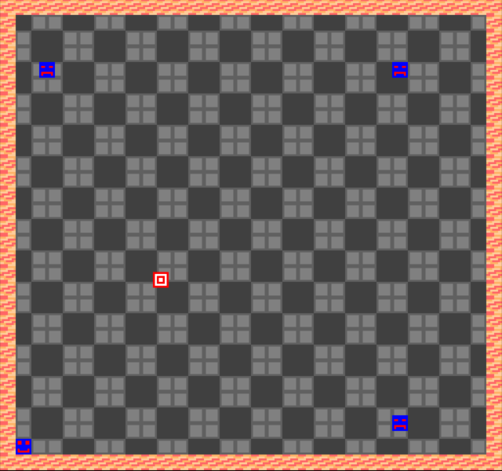

# Bomzies

Author: Haidar Jamal

Design:   In this game there are 3 AIs that chase you around. Make it to the goal before they make it to you. Also blow them up if you need to. The pursuit strategy is naive but the enemy is fast, so move fast!

Screen Shot:

How Your Asset Pipeline Works:  
PNGs representing tiles are custom created and placed into the sprites folder. These are loaded at the start of the program in a global Load function.  
Palettes are stored in a vector of structs and loaded with the read_chunks function.  
jam && sprites\pack-sprites.exe to compile palettes

How To Play:
  
Help the robot reach the base before the enemies reach the robot! Arrow keys to move robot. Space bar to create bomb. If an enemy hits bomb, it gets pushed back.

Sources: I created all assets using GIMP.

This game was built with [NEST](NEST.md).

